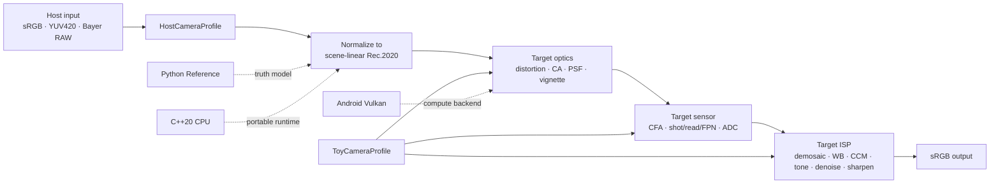

# PhyToyEngine

> English first · [中文说明](#中文说明) · [Project About](ABOUT.md)

PhyToyEngine is a profile-driven physical toy-camera imaging engine. It reconstructs a
canonical scene-linear image from a host camera and then simulates a fixed-focus toy
camera's optics, digital sensor, ADC, and ISP in a fixed physical order.

This repository currently delivers an engineering Alpha: a Python reference engine, a
C++20 CPU runtime with a stable C ABI, integrity-checked camera profiles, a native CLI,
an Android Vulkan compute backend, stage outputs, and numerical/statistical regression
tests. It is an engine core, not yet a commercial camera application.

## Pipeline and architecture



The order is invariant: host normalization → target optics → target sensor → target ISP.
Changing a camera look means replacing a validated profile, not editing engine code.

## Implemented Alpha scope

- Host normalization: encoded sRGB, BT.709 YUV420 full/limited range, and Bayer RAW.
- Optics: radial/tangential distortion, lateral chromatic aberration, per-channel
  vignetting, and spatially varying PSF basis fields.
- Sensor: CFA sampling, Poisson shot noise, read/row/column noise, PRNU/DSNU, full-well
  clipping, conversion gain, black level, and ADC quantization.
- ISP: normalized bilinear demosaic, white balance, color matrix, tone curve, Gaussian
  denoise, unsharp masking, and sRGB output encoding.
- Runtime: C++20 shared library, stable C ABI v1, CPU backend, Android Vulkan backend,
  automatic CPU fallback, native CLI, and five stage callbacks.
- Validation: strict semantic profile checks, SHA-256 checked `.ptp` packages, frozen
  golden manifest, sensor statistics, and Python/C++ stage conformance tests.

## Repository layout

```text
core/include/phytoy/       Public C ABI
core/src/                  Runtime, profile package, JSON and SHA-256
backends/cpu/              Portable CPU render graph
backends/vulkan/           Android Vulkan runtime and compute shaders
reference/phytoy_ref/      Python truth implementation
profiles/authoring/        Editable Host/Toy camera profiles
schemas/                   JSON schema descriptions
goldens/                   Frozen regression manifests
cli/                       Native PPM/PGM renderer
docs/                      Build, integration and acceptance notes
```

## Quick start: Python reference

Python 3.10+ with NumPy, SciPy, Pillow, and pytest is required.

```bash
python3 -m pip install -e .
python3 -m pytest -q
```

Render a PNG/JPEG input and optionally save all five stages as NumPy arrays:

```bash
PYTHONPATH=reference python3 -m phytoy_ref.cli \
  --input input.png \
  --host-profile profiles/authoring/host_generic_srgb.json \
  --toy-profile profiles/authoring/toy_fixed_focus_alpha.json \
  --output renders/output.png \
  --dump-stages stages/reference \
  --seed 7
```

Compile a validated authoring profile into the runtime package format:

```bash
PYTHONPATH=reference python3 -m phytoy_ref.profile_package \
  profiles/authoring/toy_fixed_focus_alpha.json \
  build/profiles/toy_fixed_focus_alpha.ptp
```

## Quick start: C++20 runtime and CLI

```bash
cmake -S . -B build -G Ninja -DCMAKE_BUILD_TYPE=RelWithDebInfo
cmake --build build --parallel
ctest --test-dir build --output-on-failure
```

The native CLI deliberately uses dependency-free binary PPM/PGM input. sRGB input must
be PPM; RAW digital-number input must be PGM.

```bash
./build/phytoy_cli \
  --input input.ppm \
  --input-format srgb \
  --host build/profiles/host_generic_srgb.ptp \
  --toy build/profiles/toy_fixed_focus_alpha.ptp \
  --output renders/native.ppm \
  --backend cpu \
  --dump-stages stages/native \
  --seed 7
```

The public API is [phytoy.h](core/include/phytoy/phytoy.h). Call
`pte_engine_create`, select `PTE_BACKEND_CPU`, `PTE_BACKEND_VULKAN`, or
`PTE_BACKEND_AUTO`, then call `pte_engine_render`. The caller owns input/output memory;
stage callback pointers remain valid only during the callback.

## Android Vulkan build

Use Android API 26+ and an NDK containing `glslc`:

```bash
cmake -S . -B build-android-arm64 -G Ninja \
  -DCMAKE_TOOLCHAIN_FILE="$ANDROID_NDK_HOME/build/cmake/android.toolchain.cmake" \
  -DANDROID_ABI=arm64-v8a \
  -DANDROID_PLATFORM=26 \
  -DPHYTOY_BUILD_CLI=OFF \
  -DPHYTOY_BUILD_TESTS=OFF \
  -DBUILD_TESTING=OFF \
  -DPHYTOY_GLSLC="$ANDROID_NDK_HOME/shader-tools/darwin-x86_64/glslc"
cmake --build build-android-arm64 --parallel
```

The resulting `libphytoy_core.so` embeds validated SPIR-V. The Alpha Vulkan path uses
host-visible coherent storage buffers, runs optics/sensor/ISP compute passes, and falls
back to CPU in `PTE_BACKEND_AUTO` when Vulkan initialization is unavailable. See
[Android Vulkan integration](docs/ANDROID_VULKAN.md) for constraints and acceptance work.

## Reproducibility and tests

- The same input/profile/seed is bit-identical within one backend.
- Noise-disabled fixtures compare all five Python/C++ stages with stage-specific limits.
- Stochastic sensor tests validate mean–variance behavior and fixed-pattern stability.
- Golden stages are canonicalized to rounded little-endian float32 before SHA-256.
- `.ptp` packages reject wrong kind, unsupported schema, truncation, and payload damage.

Run all host tests through CTest after building. A plain Python test run intentionally
skips the C++ conformance case unless `PHYTOY_CPP_LIBRARY` and
`PHYTOY_CPP_PROFILE_DIR` are set.

## Alpha limitations

- `host_reference_raw.json` is a synthetic RAW calibration placeholder, not a measured
  phone profile. A named SM-S9210 camera-0 profile is included from Camera2 static metadata,
  but remains chart-unvalidated; see the [profile derivation](docs/SM_S9210_RAW_PROFILE.md).
- Android arm64, SPIR-V, and a five-stage Vulkan conformance render were verified on a
  Samsung SM-S9210 / Adreno 750. 720p/12 MP performance and thermal endurance are not yet
  accepted; see the [device report](reports/samsung_sm_s9210_vulkan_conformance_20260820.json).
- The Vulkan Alpha uses a staging/host-visible buffer path. AHardwareBuffer zero-copy,
  tiled 12 MP final rendering, thermal testing, and driver-matrix validation remain
  productization work.
- The sensor model is digital-only; film chemistry, flash, rolling shutter, motion blur,
  autofocus, and multi-camera fusion are outside this Alpha.
- The bundled toy profile proves the engine path but is not yet a measured commercial
  camera emulation.

For the complete product and technical rationale, read the
[engine implementation specification](phytoy_engine_core_detailed_research_and_implementation_spec_2026.md)
and the [Alpha acceptance report](docs/ALPHA_ACCEPTANCE.md).

## License and contributions

PhyToyEngine is available under the MIT License. Contributions, research fixtures, new
host profiles, measured toy-camera profiles, tests, and backend improvements are welcome.
Do not submit camera samples or calibration data unless you have the right to redistribute
them.

---

# 中文说明

PhyToyEngine 是一个由配置档案驱动的物理玩具相机成像引擎。它先把手机或其他
宿主相机的 sRGB、YUV420 或 Bayer RAW 输入归一化为统一的场景线性 Rec.2020，
再按照固定顺序模拟目标玩具相机的镜头、数字传感器、ADC 和 ISP。

当前仓库交付的是“工程 Alpha”，不是完整商业相机 App。已经包含 Python 高精度
参考实现、C++20 CPU Runtime、稳定 C ABI、Android Vulkan compute 后端、Profile
编译与校验、CLI、五阶段输出、Golden 测试和传感器统计测试。

## 当前能力

- 宿主归一化：sRGB、BT.709 YUV420 全/有限范围、Bayer RAW。
- 目标镜头：畸变、横向色差、暗角、空间变化 PSF 基函数场。
- 目标传感器：CFA、散粒噪声、读出/行列/FPN 噪声、满阱、增益和 ADC。
- 目标 ISP：去马赛克、白平衡、颜色矩阵、曲线、基础降噪与锐化。
- 执行后端：Python Reference、C++ CPU、Android Vulkan，以及 Vulkan 不可用时的
  CPU 回退。
- 可验证性：固定 seed、Profile SHA-256、Golden manifest、Python/C++ 逐阶段误差
  对比和统计测试。

## 使用方法

运行 Python 参考测试：

```bash
python3 -m pip install -e .
python3 -m pytest -q
```

渲染普通图片：

```bash
PYTHONPATH=reference python3 -m phytoy_ref.cli \
  --input input.png \
  --host-profile profiles/authoring/host_generic_srgb.json \
  --toy-profile profiles/authoring/toy_fixed_focus_alpha.json \
  --output renders/output.png \
  --dump-stages stages/reference \
  --seed 7
```

构建并测试 C++ Runtime：

```bash
cmake -S . -B build -G Ninja -DCMAKE_BUILD_TYPE=RelWithDebInfo
cmake --build build --parallel
ctest --test-dir build --output-on-failure
```

Android 的详细 NDK 构建参数见上方英文说明和
[Android Vulkan 接入文档](docs/ANDROID_VULKAN.md)。业务侧通过
[phytoy.h](core/include/phytoy/phytoy.h) 创建 Engine、选择后端并提交帧；更换
HostCameraProfile 或 ToyCameraProfile 不需要修改引擎代码。

## 重要限制

仓库包含合成 RAW 档案和一份由 SM-S9210 Camera2 静态元数据推导的具名档案，但后者
仍未经过色卡、暗场和平场验证；Toy Profile 也是工程参数，不能宣传为真实相机复刻。
Android arm64
原生库、SPIR-V 和五阶段 Vulkan 误差已在 Samsung SM-S9210 / Adreno 750 真机验证；
720p 帧率、12MP 时延、温升和更多驱动兼容性仍需后续验收。完整状态见
[Alpha 验收报告](docs/ALPHA_ACCEPTANCE.md)。

本项目采用 MIT 协议，欢迎贡献代码、论文复现、合法可分发的标定数据、相机档案、
测试向量和 Android/iOS 后端。
