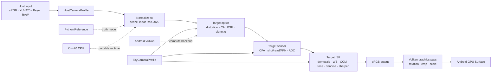

# PhyToyEngine

> English first · [中文说明](#中文说明) · [Project About](ABOUT.md)

PhyToyEngine is a profile-driven physical toy-camera imaging engine. It reconstructs a
canonical scene-linear image from a host camera and then simulates a fixed-focus toy
camera's optics, digital sensor, ADC, and ISP in a fixed physical order.

This repository currently delivers the **Synthetic Alpha device-accepted engine candidate**.
Its first immutable designed profile is **PhyToy Digital 01 v1.0.0**; Android now defaults
to the product-balanced **v1.1.0** tuning. The engine includes a Python reference,
a C++20 CPU runtime with a versioned C ABI, integrity-checked profiles, an Android Vulkan
compute/presentation backend, Camera2 `AHardwareBuffer` zero-copy input, a processed GPU
preview Surface, and numerical/statistical regression tooling. It is an engine core and
an Android Synthetic Alpha experience, not yet a complete commercial camera application.

## Pipeline and architecture



The order is invariant: host normalization → target optics → target sensor → target ISP.
Changing a camera look means replacing a validated profile, not editing engine code.

## Implemented Alpha scope

- Host normalization: encoded sRGB, BT.709 YUV420 full/limited range, and Bayer RAW.
- Optics: radial/tangential distortion, lateral chromatic aberration, per-channel
  vignetting, and spatially varying PSF basis fields.
- Sensor: CFA sampling, Poisson shot noise, read/row/column noise, PRNU/DSNU, full-well
  clipping, conversion gain, black level, and ADC quantization.
- ISP: normalized bilinear demosaic, white balance, color matrix, tone curve, Gaussian
  denoise, unsharp masking, and sRGB output encoding.
- Runtime: C++20 shared library, versioned C ABI v2, CPU backend, Android Vulkan backend,
  automatic CPU fallback, native CLI, and five stage callbacks.
- Android production path: one queue submission per frame, persistent descriptor/buffer
  reuse, aliased production intermediates, cached `AHardwareBuffer` imports, sampler YCbCr
  conversion, sync-fd acquisition, and direct final-sRGB presentation through a Vulkan
  Android swapchain with no CPU readback.
- Product profile: immutable `PhyToy Digital 01 v1.0.0` baseline plus product-balanced
  `v1.1.0` tuning, explicitly marked as a designed synthetic camera rather than a measured replica.
- Validation: strict semantic profile checks, SHA-256 checked `.ptp` packages, frozen
  golden manifest, sensor statistics, and Python/C++ stage conformance tests.

## Repository layout

```text
core/include/phytoy/       Public C ABI
core/src/                  Runtime, profile package, JSON and SHA-256
backends/cpu/              Portable CPU render graph
backends/vulkan/           Android Vulkan runtime and compute shaders
reference/phytoy_ref/      Python truth implementation
profiles/authoring/        Editable Host/Toy camera profiles
schemas/                   JSON schema descriptions
goldens/                   Frozen regression manifests
acceptance/                Versioned product acceptance contracts
cli/                       Native PPM/PGM renderer
tools/                     Benchmarks, device runners and comparison tools
docs/                      Build, integration and acceptance notes
```

## Quick start: Python reference

Python 3.10+ with NumPy, SciPy, Pillow, and pytest is required.

```bash
python3 -m pip install -e .
python3 -m pytest -q
```

Render a PNG/JPEG input and optionally save all five stages as NumPy arrays:

```bash
PYTHONPATH=reference python3 -m phytoy_ref.cli \
  --input input.png \
  --host-profile profiles/authoring/host_generic_srgb.json \
  --toy-profile profiles/authoring/toy_phytoy_digital_01_v1_1.json \
  --output renders/output.png \
  --dump-stages stages/reference \
  --seed 7
```

Compile a validated authoring profile into the runtime package format:

```bash
PYTHONPATH=reference python3 -m phytoy_ref.profile_package \
  profiles/authoring/toy_phytoy_digital_01_v1_1.json \
  build/profiles/toy_phytoy_digital_01_v1_1.ptp
```

## Quick start: C++20 runtime and CLI

```bash
cmake -S . -B build -G Ninja -DCMAKE_BUILD_TYPE=RelWithDebInfo
cmake --build build --parallel
ctest --test-dir build --output-on-failure
```

The native CLI deliberately uses dependency-free binary PPM/PGM input. sRGB input must
be PPM; RAW digital-number input must be PGM.

```bash
./build/phytoy_cli \
  --input input.ppm \
  --input-format srgb \
  --host build/profiles/host_generic_srgb.ptp \
  --toy build/profiles/toy_phytoy_digital_01_v1_1.ptp \
  --output renders/native.ppm \
  --backend cpu \
  --dump-stages stages/native \
  --seed 7
```

The public API is [phytoy.h](core/include/phytoy/phytoy.h). Call
`pte_engine_create`, select `PTE_BACKEND_CPU`, `PTE_BACKEND_VULKAN`, or
`PTE_BACKEND_AUTO`, then call `pte_engine_render`. The caller owns input/output memory;
stage callback pointers remain valid only during the callback.

## Android Vulkan build

For application integration, the repository now also includes an Android AAR, Kotlin API,
Camera2 sample, and real PRIVATE-buffer smoke contract. See the
[Android SDK guide](android/README.md).

Use Android API 26+ and an NDK containing `glslc`:

```bash
cmake -S . -B build-android-arm64 -G Ninja \
  -DCMAKE_TOOLCHAIN_FILE="$ANDROID_NDK_HOME/build/cmake/android.toolchain.cmake" \
  -DANDROID_ABI=arm64-v8a \
  -DANDROID_PLATFORM=26 \
  -DPHYTOY_BUILD_CLI=OFF \
  -DPHYTOY_BUILD_TESTS=OFF \
  -DBUILD_TESTING=OFF \
  -DPHYTOY_GLSLC="$ANDROID_NDK_HOME/shader-tools/darwin-x86_64/glslc"
cmake --build build-android-arm64 --parallel
```

The resulting `libphytoy_core.so` embeds validated SPIR-V. Normalization, optics, sensor,
ISP, and the final GPU Surface graphics pass execute in one command buffer and one queue
submission. Buffers, descriptors, parameters, and up to eight Camera2 buffer-slot imports
are reused. `PTE_BACKEND_AUTO` falls back to CPU when Vulkan initialization is unavailable.

### Camera2 zero-copy input

Create an `AImageReader` with `AIMAGE_FORMAT_PRIVATE` and
`AHARDWAREBUFFER_USAGE_GPU_SAMPLED_IMAGE`, acquire an `AImage`, obtain its
`AHardwareBuffer`, then call `pte_engine_render_ahardware_buffer`. For the async ImageReader
API, pass the acquire fence fd; the engine duplicates it, so the application still closes
its original fd after the synchronous render returns.

```c
AHardwareBuffer* hardware_buffer = NULL;
AImage_getHardwareBuffer(image, &hardware_buffer);

pte_ahardware_buffer_frame_t frame = {
    PTE_ABI_VERSION, hardware_buffer, width, height, acquire_fence_fd
};
pte_engine_set_backend(engine, PTE_BACKEND_VULKAN);
pte_status_t status = pte_engine_render_ahardware_buffer(
    engine, &frame, &options, &output);

/* On AImageReader buffer removal, or when closing the camera session: */
pte_engine_forget_ahardware_buffer(engine, hardware_buffer);
```

For live preview, first call `pte_engine_set_output_surface` with an `ANativeWindow` and
clockwise output rotation, then call `pte_engine_process_ahardware_buffer` from a dedicated
latest-frame worker. It executes normalization, PhyToy Digital 01 optics/sensor/ISP, and
the swapchain graphics pass in the same submission. Camera2 must target only the engine
input Surface; adding a second raw preview target would bypass the processed result and
increase Camera HAL power.

The zero-copy claim applies to camera input: the `AHardwareBuffer` is sampled directly by
Vulkan. The render API writes the final float32 image to caller-owned memory; the preview
process API keeps the final image on GPU and presents it without CPU readback.

## Reproducibility and tests

- The same input/profile/seed is bit-identical within one backend.
- Noise-disabled fixtures compare all five Python/C++ stages with stage-specific limits.
- Stochastic sensor tests validate mean–variance behavior and fixed-pattern stability.
- Golden stages are canonicalized to rounded little-endian float32 before SHA-256.
- `.ptp` packages reject wrong kind, unsupported schema, truncation, and payload damage.

Run all host tests through CTest after building. A plain Python test run intentionally
skips the C++ conformance case unless `PHYTOY_CPP_LIBRARY` and
`PHYTOY_CPP_PROFILE_DIR` are set.

## Synthetic Alpha acceptance

The versioned acceptance contract is
[synthetic_alpha_v1.json](acceptance/synthetic_alpha_v1.json). It defines 720p latency,
12MP latency/memory, thermal, 10,000-frame, one-submit, resource-reuse, zero-copy, and
cross-backend consistency limits. Run the host benchmark directly or the complete Android
suite:

```bash
./build/phytoy_benchmark \
  --host build/profiles/host_generic_srgb.ptp \
  --toy build/profiles/toy_phytoy_digital_01_v1.ptp \
  --backend cpu --input f32 --width 1280 --height 720 --warmup 3 --frames 30

tools/run_android_acceptance.sh
```

The Android suite also dumps all five deterministic stages from CPU, Vulkan float32, and
Vulkan `AHardwareBuffer` execution and compares each path with the Python reference using
the contract's versioned tolerances. It additionally checks PhyToy Digital 01 sensor
mean/variance over 128 seeds and fixed-seed repeatability on all three paths.

The full contract passed 101/101 checks on Samsung SM-S9210 / Adreno 750. See the
[machine-readable reports](reports/synthetic_alpha_candidate/) for exact device provenance,
latency, memory, thermal, endurance, numerical, and statistical results.

## Alpha limitations

- `host_reference_raw.json` is a synthetic RAW calibration placeholder, not a measured
  phone profile. A named SM-S9210 camera-0 profile is included from Camera2 static metadata,
  but remains chart-unvalidated; see the [profile derivation](docs/SM_S9210_RAW_PROFILE.md).
- Engine 0.3.0 completes the real Camera2 PRIVATE → full Vulkan profile graph → Android
  GPU Surface path. On SM-S9210 it passed all 17/17 processed-preview checks: 30 rendered,
  submitted, zero-copy, and presented frames; 0 queue drops/errors; P50 52.622 ms and P95
  59.161 ms while the already-warm device was in Android thermal Light mode; and a stable
  720×1560 swapchain with no recreation. See the
  [processed-preview report](reports/android_camera2_sm_s9210_0_3_0_processed_preview/evaluation.json).
  A 30-minute unplugged run and the multi-vendor matrix remain product gates.
- Android 0.3.0 uses a 15 FPS normal processed preview and automatically steps down to
  10/5/3/0 FPS at light, moderate, severe, and critical thermal states. Camera2 is fixed at
  15 FPS because the raw preview bypass has been removed; generating unseen 24–30 FPS
  frames would only increase Camera HAL/ISP power. Thermal skips remain separate from true
  queue drops.
- The 12MP production path uses approximately 336 MiB of persistent Vulkan float32 working
  buffers plus the caller's output. Tiled/float16 internals and direct encoded output remain
  future memory reductions, not prerequisites of the current explicit acceptance contract.
- The sensor model is digital-only; film chemistry, flash, rolling shutter, motion blur,
  autofocus, and multi-camera fusion are outside this Alpha.
- PhyToy Digital 01 is an original designed profile. It is commercially usable as a
  synthetic look after device acceptance, but it must not be marketed as a measured replica.

For the complete product and technical rationale, read the
[engine implementation specification](docs/physical_toy_camera_engine_product_technical_development_plan_2026.md)
and the [Alpha acceptance report](docs/ALPHA_ACCEPTANCE.md).

## Research references and open-source projects

PhyToyEngine's architecture and Alpha models were informed by the public papers and
projects below. They are cited as research and engineering references, not as runtime
dependencies. This repository does not vendor their source code or pretrained models.
License and redistribution terms must be reviewed before reusing any external code,
data, or calibration assets.

### Papers and standards

| Reference | Relevant area | How it informs PhyToyEngine |
| --- | --- | --- |
| [Recovering High Dynamic Range Radiance Maps from Photographs](https://doi.org/10.1145/258734.258884), Debevec & Malik, SIGGRAPH 1997 | Exposure response and radiance recovery | Motivation for separating scene-linear signal from display-space output. |
| [What Is the Space of Camera Response Functions?](https://cave.cs.columbia.edu/old/publications/pdfs/Grossberg_CVPR03.pdf), Grossberg & Nayar, CVPR 2003 | Camera response functions | Reference for response-curve constraints and future host-camera calibration. |
| [High-Quality Linear Interpolation for Demosaicing of Bayer-Patterned Color Images](https://doi.org/10.1109/ICASSP.2004.1326587), Malvar, He & Cutler, ICASSP 2004 | Bayer demosaicing | A fixed, interpretable demosaicing baseline for comparison; Alpha currently uses normalized bilinear demosaicing. |
| [Practical Poissonian-Gaussian Noise Modeling and Fitting for Single-Image Raw-Data](https://doi.org/10.1109/TIP.2008.2001399), Foi et al., IEEE TIP 2008 | Signal-dependent RAW noise | Direct reference for shot/read noise, variance behavior, and clipping-aware sensor statistics. |
| [Color Correction Using Root-Polynomial Regression](https://doi.org/10.1109/TIP.2015.2405336), Finlayson, Mackiewicz & Hurlbert, IEEE TIP 2015 | Camera color correction | Candidate upgrade path when a 3×3 CCM is insufficient during real-camera calibration. |
| [Unprocessing Images for Learned Raw Denoising](https://openaccess.thecvf.com/content_CVPR_2019/html/Brooks_Unprocessing_Images_for_Learned_Raw_Denoising_CVPR_2019_paper.html), Brooks et al., CVPR 2019 | Inverse ISP and RAW synthesis | Supports the separation of gain, white balance, color correction, tone mapping, and noise when building a compatibility path. |
| [A Physics-Based Noise Formation Model for Extreme Low-Light Raw Denoising](https://openaccess.thecvf.com/content_CVPR_2020/html/Wei_A_Physics-Based_Noise_Formation_Model_for_Extreme_Low-Light_Raw_Denoising_CVPR_2020_paper.html), Wei et al., CVPR 2020 | Low-light CMOS noise | Beta-level reference for richer noise distributions and calibration beyond the Alpha model. |
| [Learning Lens Blur Fields](https://blur-fields.github.io/), Lin et al., IEEE TPAMI 2025 | Spatially varying PSF | Reference for acquiring and compressing device-specific PSF fields during offline calibration. |
| [A Physics-Informed Blur Learning Framework for Imaging Systems](https://openaccess.thecvf.com/content/CVPR2025/html/Chen_A_Physics-Informed_Blur_Learning_Framework_for_Imaging_Systems_CVPR_2025_paper.html), Chen et al., CVPR 2025 | Physics-informed PSF estimation | Candidate method for fitting spatially varying blur without requiring a full lens prescription. |
| [Deep Bilateral Learning for Real-Time Image Enhancement](https://groups.csail.mit.edu/graphics/hdrnet/data/hdrnet.pdf), Gharbi et al., SIGGRAPH 2017 | Mobile learned ISP | Future reference for learned tone and local enhancement; not part of the Alpha runtime. |
| [EMVA 1288 standard](https://www.emva.org/standards-technology/emva-1288/emva-standard-1288-downloads-2/) | Sensor characterization | Reference vocabulary and measurement structure for noise, sensitivity, dynamic range, and calibration reports. |

### Open-source projects

| Project | Relevant area | Role in this project |
| --- | --- | --- |
| [DeepLens](https://github.com/vccimaging/DeepLens) | Differentiable optics, ray tracing, PSF and sensor simulation | Offline research reference for optics and image-formation experiments; not a runtime dependency. |
| [End2endImaging](https://github.com/vccimaging/End2endImaging) | End-to-end differentiable computational imaging | Reference for composing optics, sensor, ISP, and reconstruction as one graph. |
| [Infinite-ISP](https://github.com/10x-Engineers/Infinite-ISP) | Modular RAW-to-RGB ISP and tuning | Reference for ISP module boundaries, fixed-point thinking, tuning workflows, and test organization. |
| [PSF-Estimation](https://github.com/OpenImagingLab/PSF-Estimation) | Physics-informed spatial PSF estimation | Companion code for the CVPR 2025 PSF paper; useful for future offline calibration tooling. |
| [Learning Lens Blur Fields](https://github.com/estherlin/learning-lens-blur-fields) | Device-specific lens blur-field acquisition | Reference implementation for a possible offline PSF-field fitting pipeline. |
| [ISETCam](https://github.com/ISET/isetcam) | Scene, optics, sensor, and ISP simulation | System-level research reference for sensor and camera-pipeline experiments. |
| [OpenCV](https://github.com/opencv/opencv) | Calibration, geometry, chart detection, and image utilities | Candidate offline toolset; only the smallest required subset should be considered for mobile integration. |
| [Colour](https://github.com/colour-science/colour) | Colour spaces, adaptation, spectral calculations, and ΔE | Offline reference for color transforms and calibration validation. |
| [LibRaw](https://github.com/LibRaw/LibRaw) | RAW decoding and camera metadata | Desktop/import reference for RAW formats; its LGPL-2.1/CDDL-1.0 licensing requires review before commercial redistribution. |
| [Halide](https://github.com/halide/Halide) | Portable data-parallel CPU/GPU pipelines | Future optimization and backend-spike reference for CPU, Vulkan, and Metal targets. |
| [Random123](https://github.com/DEShawResearch/random123) | Counter-based random number generation and Philox | Reference for deterministic, streamable stochastic sensor noise across backends. |
| [HDRNet](https://github.com/google/hdrnet) | Learned bilateral-grid ISP | Historical mobile-ISP reference; not used as an Alpha dependency. |

### Attribution boundary

The current Alpha implementation is independently written. The references above shape
the model choices, calibration plan, testing strategy, and future roadmap; they do not
mean that PhyToyEngine reproduces every method or result from those works. New profiles,
calibration data, and third-party integrations must record their source, license, and
whether the material is suitable for commercial redistribution.

## License and contributions

PhyToyEngine is available under the MIT License. Contributions, research fixtures, new
host profiles, measured toy-camera profiles, tests, and backend improvements are welcome.
Do not submit camera samples or calibration data unless you have the right to redistribute
them.

---

# 中文说明

PhyToyEngine 是一个由配置档案驱动的物理玩具相机成像引擎。它先把手机或其他
宿主相机的 sRGB、YUV420 或 Bayer RAW 输入归一化为统一的场景线性 Rec.2020，
再按照固定顺序模拟目标玩具相机的镜头、数字传感器、ADC 和 ISP。

当前仓库交付的是 **Synthetic Alpha 已通过设备协议的引擎候选版**，第一款锁定的原创虚拟相机是
**PhyToy Digital 01 v1.0.0**，Android 现默认使用产品化收敛后的 **v1.1.0** 调校。
它不是完整商业相机 App，但已包含 Python 高精度
参考实现、C++20 CPU Runtime、稳定 C ABI、Android Vulkan compute 后端、Camera2
AHardwareBuffer 零拷贝输入、Profile 编译校验、Golden 和统计测试。

## 当前能力

- 宿主归一化：sRGB、BT.709 YUV420 全/有限范围、Bayer RAW。
- 目标镜头：畸变、横向色差、暗角、空间变化 PSF 基函数场。
- 目标传感器：CFA、散粒噪声、读出/行列/FPN 噪声、满阱、增益和 ADC。
- 目标 ISP：去马赛克、白平衡、颜色矩阵、曲线、基础降噪与锐化。
- 执行后端：Python Reference、C++ CPU、Android Vulkan，以及 Vulkan 不可用时的
  CPU 回退。
- Vulkan 生产路径：每帧一次提交、持久资源复用、中间 Buffer 原地复用、Camera2
  Buffer 槽位缓存、外部格式 YCbCr conversion 和 acquire fence。
- 原创 Profile：PhyToy Digital 01 明确标记为 designed/synthetic，不冒充真实相机复刻。
- 可验证性：固定 seed、Profile SHA-256、Golden manifest、Python/C++ 逐阶段误差
  对比和统计测试。

## 使用方法

运行 Python 参考测试：

```bash
python3 -m pip install -e .
python3 -m pytest -q
```

渲染普通图片：

```bash
PYTHONPATH=reference python3 -m phytoy_ref.cli \
  --input input.png \
  --host-profile profiles/authoring/host_generic_srgb.json \
  --toy-profile profiles/authoring/toy_phytoy_digital_01_v1_1.json \
  --output renders/output.png \
  --dump-stages stages/reference \
  --seed 7
```

构建并测试 C++ Runtime：

```bash
cmake -S . -B build -G Ninja -DCMAKE_BUILD_TYPE=RelWithDebInfo
cmake --build build --parallel
ctest --test-dir build --output-on-failure
```

Android 的详细 NDK 构建参数见上方英文说明和
[Android Vulkan 接入文档](docs/ANDROID_VULKAN.md)。业务侧通过
[phytoy.h](core/include/phytoy/phytoy.h) 创建 Engine、选择后端并提交帧；更换
HostCameraProfile 或 ToyCameraProfile 不需要修改引擎代码。

Camera2 实时预览建议使用 `AIMAGE_FORMAT_PRIVATE` 与
`AHARDWAREBUFFER_USAGE_GPU_SAMPLED_IMAGE`，通过 `AImage_getHardwareBuffer` 取得
输入，并调用 `pte_engine_render_ahardware_buffer`。相机会话关闭或 ImageReader 移除
Buffer 时，调用 `pte_engine_forget_ahardware_buffer` 释放缓存导入。

仓库也已包含可直接构建的 Android AAR、Kotlin API、Camera2 示例和真实 PRIVATE
Buffer 验收脚本，接入步骤见 [Android SDK 使用指南](android/README.md)。

明确的 720p、12MP、内存、温控、10,000 帧和后端一致性指标位于
[Synthetic Alpha 验收协议](acceptance/synthetic_alpha_v1.json)，完整真机命令为：

```bash
tools/run_android_acceptance.sh
```

该脚本还会自动导出 CPU、Vulkan float32 和 Vulkan AHardwareBuffer 三条路径的五个
确定性阶段，并按照协议中的版本化误差阈值分别与 Python Reference 比较；同时检查
PhyToy Digital 01 在 128 个 seed 下的传感器均值/方差和三条路径的固定 seed 重复性。

## 重要限制

仓库包含合成 RAW 档案和一份由 SM-S9210 Camera2 静态元数据推导的具名档案，但后者
仍未经过色卡、暗场和平场验证；Toy Profile 也是工程参数，不能宣传为真实相机复刻。
新版单次提交、shared-memory ISP、Buffer 原地复用和合成 RGBA AHardwareBuffer 路径
已在 Samsung SM-S9210 / Adreno 750 上通过 101/101 项协议检查，包括 720p、12MP、
温升、10,000 帧、五阶段误差和随机统计。完整结果位于
[真机验收报告](reports/synthetic_alpha_candidate/)。引擎 0.3.0 又完成了真实 Camera2
`AIMAGE_FORMAT_PRIVATE` → 完整 Vulkan Profile → Android GPU Surface 链路，并在
SM-S9210 上通过 17/17 项效果预览验收：30 帧渲染/提交/零拷贝/显示完全一致，队列丢帧
和错误均为 0，已处于 Light 温控状态的设备上 P50 52.622 ms、P95 59.161 ms，交换链
稳定为 720×1560 且没有重建；详见
[处理后预览报告](reports/android_camera2_sm_s9210_0_3_0_processed_preview/evaluation.json)。
30 分钟不插电长稳测试和多厂商设备矩阵仍属于后续产品门槛。

Android 0.3.0 的效果预览正常档为 15 FPS，并在 Light、Moderate、Severe、Critical
温控状态下自动降至 10、5、3、0 FPS。Camera2 固定为 15 FPS，因为原始预览旁路已经
删除；继续生成用户看不到的 24–30 FPS 只会增加 Camera HAL/ISP 功耗。温控主动跳帧与
真正的队列丢帧仍分开统计。

## 参考论文与开源项目

PhyToyEngine 的架构和 Alpha 模型参考了下面的公开论文与开源项目。它们是研究与
工程参考，不是本项目的运行时依赖；当前仓库没有直接 vendoring 它们的源代码或
预训练模型。复用外部代码、数据或标定素材前，必须单独核对许可证和再分发条款。

### 论文与标准

| 参考资料 | 方向 | 对 PhyToyEngine 的作用 |
| --- | --- | --- |
| [Recovering High Dynamic Range Radiance Maps from Photographs](https://doi.org/10.1145/258734.258884)，Debevec 与 Malik，SIGGRAPH 1997 | 曝光响应与辐亮度恢复 | 支持将场景线性信号与显示空间输出分离的总体思路。 |
| [What Is the Space of Camera Response Functions?](https://cave.cs.columbia.edu/old/publications/pdfs/Grossberg_CVPR03.pdf)，Grossberg 与 Nayar，CVPR 2003 | 相机响应函数 | 为响应曲线约束和宿主相机标定提供参考。 |
| [High-Quality Linear Interpolation for Demosaicing of Bayer-Patterned Color Images](https://doi.org/10.1109/ICASSP.2004.1326587)，Malvar、He 与 Cutler，ICASSP 2004 | Bayer 去马赛克 | 作为固定且可解释的去马赛克对照；Alpha 当前使用归一化双线性去马赛克。 |
| [Practical Poissonian-Gaussian Noise Modeling and Fitting for Single-Image Raw-Data](https://doi.org/10.1109/TIP.2008.2001399)，Foi 等，IEEE TIP 2008 | RAW 信号相关噪声 | 直接参考散粒/读出噪声、均值-方差关系和裁剪感知的传感器统计。 |
| [Color Correction Using Root-Polynomial Regression](https://doi.org/10.1109/TIP.2015.2405336)，Finlayson、Mackiewicz 与 Hurlbert，IEEE TIP 2015 | 相机颜色校正 | 当真实标定中 3×3 CCM 不足时，作为颜色模型升级候选。 |
| [Unprocessing Images for Learned Raw Denoising](https://openaccess.thecvf.com/content_CVPR_2019/html/Brooks_Unprocessing_Images_for_Learned_Raw_Denoising_CVPR_2019_paper.html)，Brooks 等，CVPR 2019 | 逆 ISP 与 RAW 合成 | 支持在兼容路径中分离增益、白平衡、颜色校正、曲线和噪声。 |
| [A Physics-Based Noise Formation Model for Extreme Low-Light Raw Denoising](https://openaccess.thecvf.com/content_CVPR_2020/html/Wei_A_Physics-Based_Noise_Formation_Model_for_Extreme_Low-Light_Raw_Denoising_CVPR_2020_paper.html)，Wei 等，CVPR 2020 | 低照度 CMOS 噪声 | 为 Beta 阶段更丰富的噪声分布和标定提供参考。 |
| [Learning Lens Blur Fields](https://blur-fields.github.io/)，Lin 等，IEEE TPAMI 2025 | 空间变化 PSF | 参考如何在离线标定中采集和压缩设备特定的 PSF 场。 |
| [A Physics-Informed Blur Learning Framework for Imaging Systems](https://openaccess.thecvf.com/content/CVPR2025/html/Chen_A_Physics-Informed_Blur_Learning_Framework_for_Imaging_Systems_CVPR_2025_paper.html)，Chen 等，CVPR 2025 | 物理约束 PSF 估计 | 为不依赖完整镜头处方的空间变化模糊拟合提供候选方法。 |
| [Deep Bilateral Learning for Real-Time Image Enhancement](https://groups.csail.mit.edu/graphics/hdrnet/data/hdrnet.pdf)，Gharbi 等，SIGGRAPH 2017 | 移动端学习型 ISP | 作为未来学习型曲线和局部增强的参考，不属于 Alpha Runtime。 |
| [EMVA 1288 标准](https://www.emva.org/standards-technology/emva-1288/emva-standard-1288-downloads-2/) | 传感器表征 | 为噪声、灵敏度、动态范围和标定报告提供术语与测量结构参考。 |

### 开源项目

| 项目 | 方向 | 在本项目中的作用 |
| --- | --- | --- |
| [DeepLens](https://github.com/vccimaging/DeepLens) | 可微光学、光线追踪、PSF 与传感器模拟 | 光学和成像实验的离线研究参考，不是 Runtime 依赖。 |
| [End2endImaging](https://github.com/vccimaging/End2endImaging) | 端到端可微计算成像 | 参考如何把光学、传感器、ISP 和重建组合成统一计算图。 |
| [Infinite-ISP](https://github.com/10x-Engineers/Infinite-ISP) | 模块化 RAW→RGB ISP 与调参 | 参考 ISP 模块边界、定点化思路、调参流程和测试组织。 |
| [PSF-Estimation](https://github.com/OpenImagingLab/PSF-Estimation) | 物理约束空间 PSF 估计 | CVPR 2025 PSF 论文的配套代码，可用于未来离线标定工具。 |
| [Learning Lens Blur Fields](https://github.com/estherlin/learning-lens-blur-fields) | 设备特定镜头模糊场采集 | 参考未来离线 PSF 场拟合流程。 |
| [ISETCam](https://github.com/ISET/isetcam) | 场景、光学、传感器和 ISP 仿真 | 系统级传感器和相机管线研究参考。 |
| [OpenCV](https://github.com/opencv/opencv) | 标定、几何、图卡检测和图像工具 | 可作为离线工具集；移动端只应考虑打包必需模块。 |
| [Colour](https://github.com/colour-science/colour) | 色彩空间、色适应、光谱计算和 ΔE | 离线颜色变换与标定验证参考。 |
| [LibRaw](https://github.com/LibRaw/LibRaw) | RAW 解码和相机元数据 | 桌面 RAW 导入参考；商用分发前必须审查其 LGPL-2.1/CDDL-1.0 双许可证。 |
| [Halide](https://github.com/halide/Halide) | 可移植数据并行 CPU/GPU 管线 | 未来 CPU、Vulkan 和 Metal 优化 Spike 的参考。 |
| [Random123](https://github.com/DEShawResearch/random123) | Counter-based RNG 与 Philox | 为不同后端实现可复现、可分流的传感器随机噪声提供参考。 |
| [HDRNet](https://github.com/google/hdrnet) | Learned bilateral-grid ISP | 经典移动 ISP 研究参考，不作为 Alpha 依赖。 |

### 归属边界

当前 Alpha 是独立编写的实现。上述资料影响了模型选择、标定方案、测试策略和
后续路线，但不代表 PhyToyEngine 复现了这些论文或项目的全部方法与结果。新增
Profile、标定数据和第三方集成时，应记录来源、许可证及是否适合商业再分发。

本项目采用 MIT 协议，欢迎贡献代码、论文复现、合法可分发的标定数据、相机档案、
测试向量和 Android/iOS 后端。
